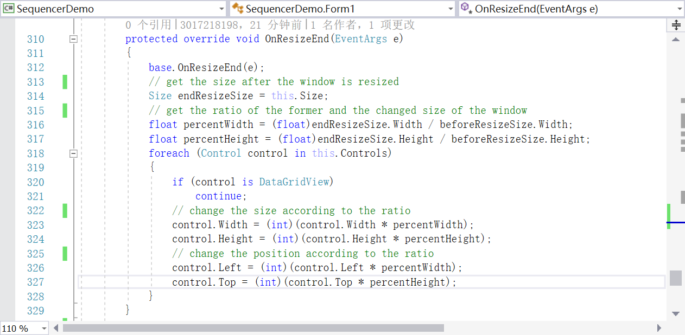
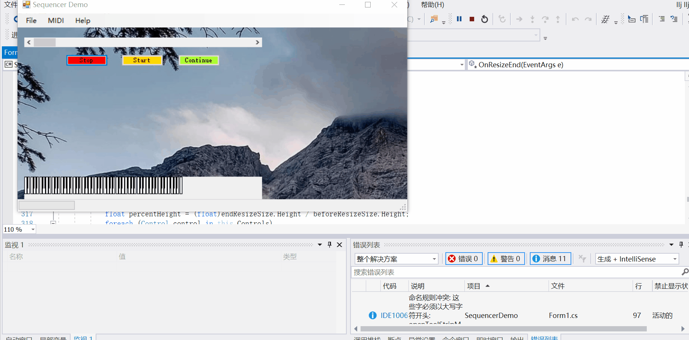

# lab02
C# lab2, by Lu Yuan, May 6th, 2019

## Introduction
1. This app is based on Sanfored.Mutilmedia.Midi
2. The changes are equipping the original app with a flexible size of component which can change automatically wheneven the size of window changed
3. This app also optimize the interface to improve users' experience

## Implement of changing the size of component automatically with window
1. This function is implemented in the region "match the size of component to windows" in Form1.cs
2. This function is based on the events Form1_ResizeBegin, OnResizeBegin, OnResizeEnd and Form1_ResizeEnd
3. The principle of this function is to get the ratio of the former size to new size of the changed window and at the same time change the size of component according to this ratio
4. Code screencut 

## Change log
#### first version(6b81eec), released in 18:37 May 6th, 2019
1. Add region "match the size of component to windows" to automatically change the size of components
2. Add a wallpaper to background
3. Optimize the button to be identified more easier
4. Screencut 
